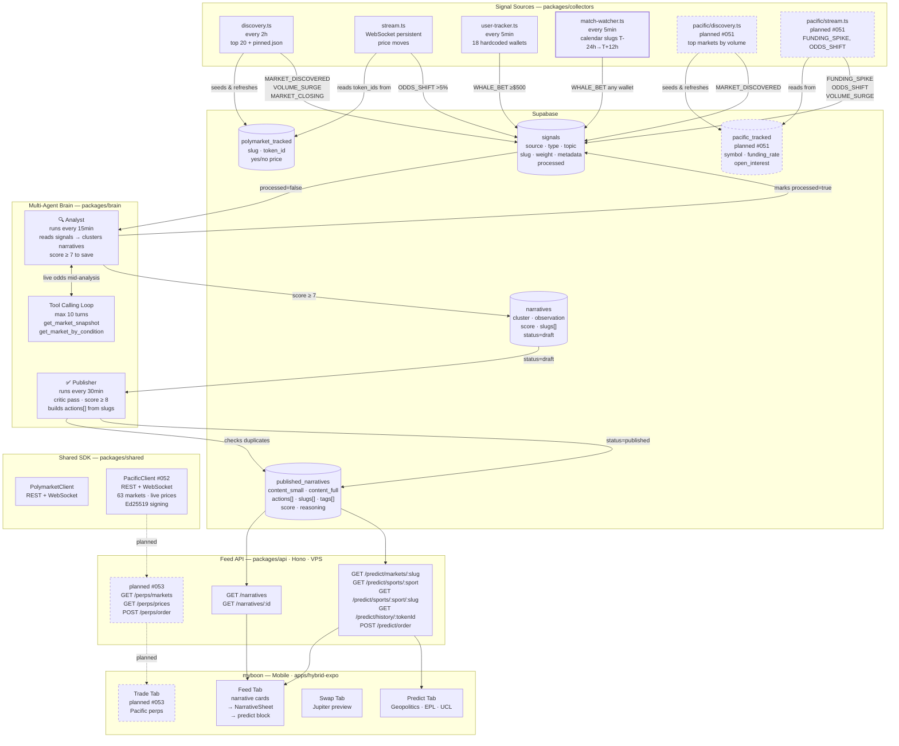

# myboon — Architecture Diagram

> Solid lines = built and live. Dashed = planned.
>
> **Collector signals:** `MARKET_DISCOVERED` · `VOLUME_SURGE` · `MARKET_CLOSING` · `ODDS_SHIFT` · `WHALE_BET` · `FUNDING_SPIKE` (planned) · `VOLUME_SURGE` (planned)
>
> **Analyst tools (live):** `get_market_snapshot(slug)` · `get_market_by_condition(conditionId)`
>
> **Published narrative actions:** `{ type: 'predict', slug }` built deterministically from `narrative.slugs[]` · `{ type: 'perps', symbol }` added by LLM for crypto signals
>
> **Pacific SDK (#052):** ✅ Complete — `PacificClient` (REST + WebSocket) in `packages/shared`, blocks #051 (collectors), #053 (Trade UI)
