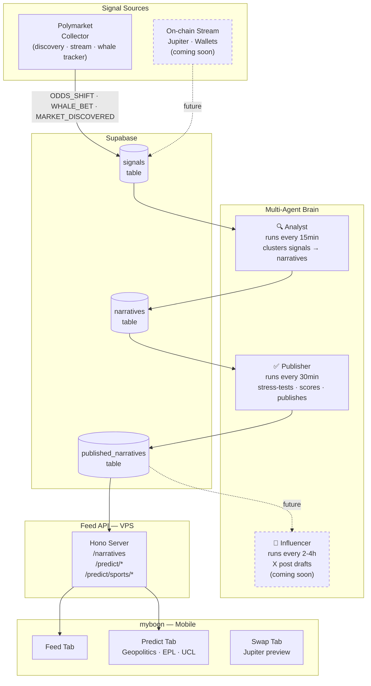

# myboon — Architecture Diagram

```mermaid
flowchart TD
    subgraph Sources["Signal Sources"]
        PM["Polymarket\nCollector\n(discovery · stream · whale tracker)"]
        OC["On-chain Stream\nJupiter · Wallets\n(coming soon)"]
    end

    subgraph DB["Supabase"]
        SIG[("signals\ntable")]
        NAR[("narratives\ntable")]
        PUB[("published_narratives\ntable")]
    end

    subgraph Brain["Multi-Agent Brain"]
        AN["🔍 Analyst\nruns every 15min\nclusters signals → narratives"]
        PB["✅ Publisher\nruns every 30min\nstress-tests · scores · publishes"]
        IN["📢 Influencer\nruns every 2-4h\nX post drafts\n(coming soon)"]
    end

    subgraph API["Feed API — VPS"]
        HONO["Hono Server\n/narratives\n/predict/*\n/predict/sports/*"]
    end

    subgraph App["myboon — Mobile"]
        FEED["Feed Tab"]
        PRED["Predict Tab\nGeopolitics · EPL · UCL"]
        SWAP["Swap Tab\nJupiter preview"]
    end

    PM -->|ODDS_SHIFT · WHALE_BET · MARKET_DISCOVERED| SIG
    OC -.->|future| SIG

    SIG --> AN
    AN --> NAR
    NAR --> PB
    PB --> PUB
    PUB -.->|future| IN

    PUB --> HONO
    HONO --> FEED
    HONO --> PRED
    SWAP

    style OC stroke-dasharray: 5 5
    style IN stroke-dasharray: 5 5
```

> Solid lines = built and live. Dashed = planned.
