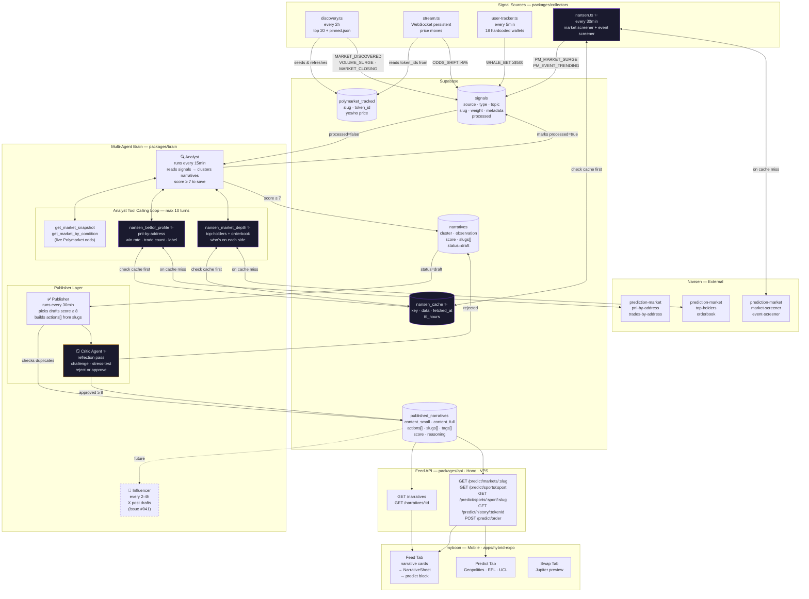

# myboon — Architecture Diagram (with Critic + Nansen)

> Solid lines = built and live. Dashed = planned. **Purple ✨ = Nansen additions. Amber = Critic layer.**

## Signal types

**Existing:** `MARKET_DISCOVERED` · `VOLUME_SURGE` · `MARKET_CLOSING` · `ODDS_SHIFT` · `WHALE_BET`

**Nansen new:** `PM_MARKET_SURGE` · `PM_EVENT_TRENDING`

## Analyst tools

**Existing:** `get_market_snapshot(slug)` · `get_market_by_condition(conditionId)`

**Nansen new:** `nansen_bettor_profile(address)` · `nansen_market_depth(market_id)`

## Nansen cache TTLs

| Data | TTL |
| --- | --- |
| Bettor PnL profile | 24h |
| Market top-holders | 15min |
| Orderbook | 5min |
| Market screener | 30min |
| Event screener | 1h |

## Publisher Critic flow

Publisher picks draft narratives (score ≥ 8) → Critic challenges assumptions, stress-tests evidence → approves (writes to `published_narratives`) or rejects (marks narrative back to review).

## Build order

1. `NansenClient` in `packages/shared` + `nansen_cache` Supabase table
2. `nansen.ts` collector → `PM_MARKET_SURGE` + `PM_EVENT_TRENDING` signals
3. Analyst tools → `nansen_bettor_profile` + `nansen_market_depth`
4. Critic agent → publisher reflection pass (issue #037)
